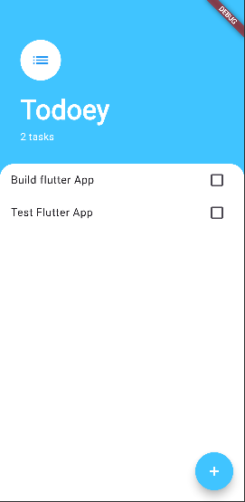
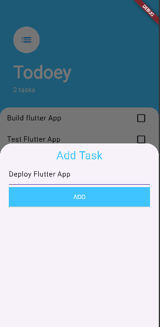
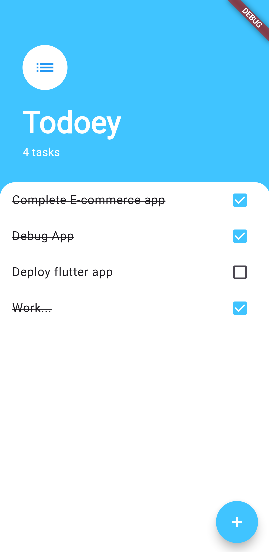

# Todoey - Simple To-Do App

Todoey is a simple and minimalistic to-do app built using Flutter. It allows users to manage their tasks effectively by adding, marking, and removing them. The app provides a clean and user-friendly interface for task management.

---

## Features

1. **Add Tasks**: Add new tasks to your to-do list.
2. **Mark Tasks as Completed**: Check off tasks as you complete them.
3. **View Tasks**: View all tasks in an organized manner.
4. **Track Task Count**: See the number of total tasks at a glance.

---

## Screenshots

   
  
  

---

## How to Use

1. Launch the app.
2. Add tasks by clicking on the **+** button and entering the task name.
3. Mark tasks as completed by checking the box next to the task.
4. Keep track of the total number of tasks shown below the app name.

---

## Technologies Used

- **Flutter**: For cross-platform app development.
- **Dart**: Programming language for Flutter.
- **Provider**: For state management.

---

## Setup and Installation

1. Clone the repo: `https://github.com/chalaAlex/flutter-todo-list-App.git`
2. Navigate to the project folder: `cd flutter-todo-list-App`
3. Install dependencies: `flutter pub get`

## Usage
- Run the app with `flutter run`.

## Contributing
Contributions are welcome! Fork the repo and submit a pull request.

## License
This project is licensed under the GNU License.

